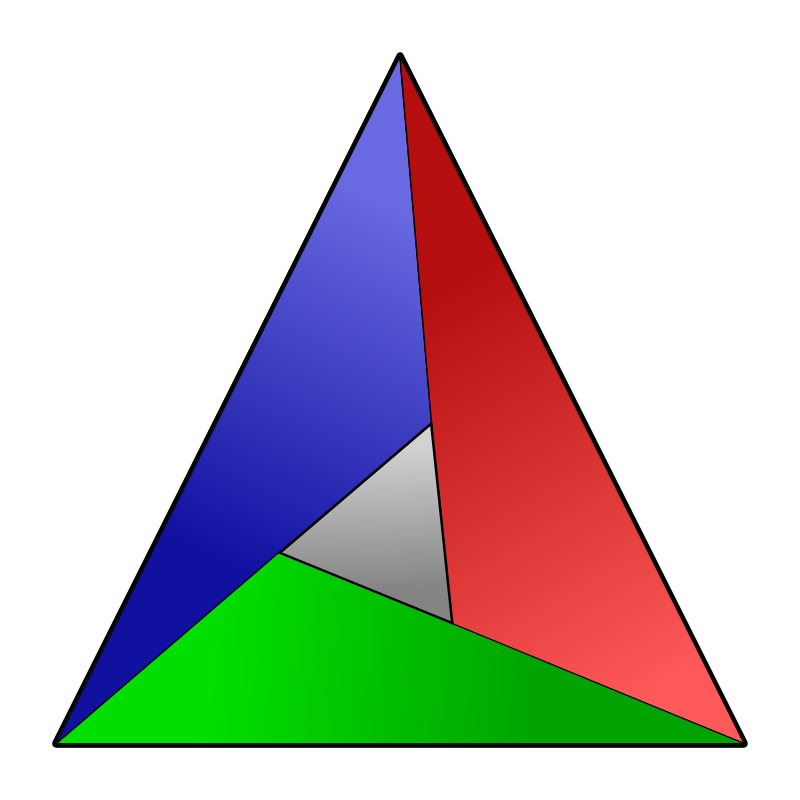

Hi My name is Volodymyr
========================================================================================================================================

Raiden
------

*   🌍  I'm based in Ukraine
*   ✉️  You can contact me at [volodymyrharash@protonmail.com](mailto:volodymyrharash@protonmail.com)
<a href="https://www.github.com/RaidenCXX" target="_blank" rel="noreferrer">

### Language

                    

                    

### Tools

     

### Social networks

  
  

### Badges

